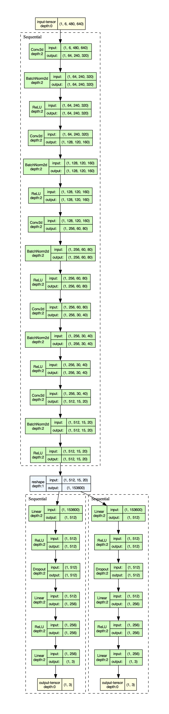
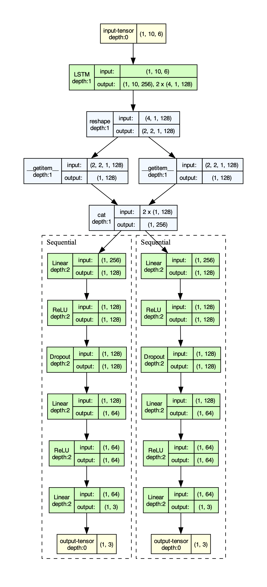

# Deep Visual-Inertial Odometry

A PyTorch-based study of **learned Visual-Inertial Odometry (VIO)** using recurrent neural networks and synthetic sensor data generated with Blender.

The system investigates three different approaches to relative 6-DoF pose estimation:

1. **Vision-Only** — estimates relative motion from consecutive RGB frames.
2. **IMU-Only** — estimates relative motion from a sequence of inertial measurements.
3. **Visual-Inertial Fusion** — processes visual and inertial measurements with separate recurrent networks before combining their learned representations.

The predicted relative poses are integrated using dead reckoning to reconstruct complete 3D trajectories.

---

# 🔬 Overview

Traditional VIO explicitly models the geometry and dynamics of the camera/IMU system. This project explores an alternative approach in which the relationship between sensor measurements and relative motion is learned directly from data.

The overall pipeline is:

```text
                         Synthetic Environment
                                  │
                              Blender
                                  │
                   ┌──────────────┴──────────────┐
                   │                             │
              RGB Images                       IMU
                   │                             │
                   ▼                             ▼
             Vision Network                IMU Network
                   │                             │
                   │                  ┌──────────┘
                   │                  │
                   ▼                  ▼
                    Learned Representations
                              │
                              ▼
                       Pose Prediction
                              │
                              ▼
                       Relative 6-DoF Pose
                              │
                              ▼
                       Dead Reckoning
                              │
                              ▼
                      3D Camera Trajectory
```

The same synthetic dataset is used to compare the contribution of each sensing modality.

---

# 🧠 Model Variants

Three models are trained and evaluated.

## 1. Vision-Only

The vision model receives two consecutive RGB frames and learns to estimate the relative pose between them.

```text
RGB Frame t ──────┐
                  ├──► Visual Feature Extraction ──► LSTM ──► Relative Pose
RGB Frame t+1 ────┘
```

The model therefore attempts to infer camera motion directly from visual appearance and temporal information.

---

## 2. IMU-Only

The inertial model receives a sequence of IMU measurements corresponding to the motion between two camera frames.

The IMU input contains:

* 3-axis accelerometer measurements
* 3-axis gyroscope measurements

```text
IMU Sequence
     │
     ▼
   LSTM
     │
     ▼
Relative 6-DoF Pose
```

This provides a learned inertial baseline against which the vision and fusion models can be compared.

---

## 3. Visual-Inertial Fusion

The fusion model processes the two sensor modalities independently before combining their learned representations.

```text
                    ┌──► Vision Network ──►┐
RGB Frames ─────────┘                       │
                                            ├──► Concatenate
                                            │
IMU Sequence ───────┐                       │
                    └──► IMU Network ──────►┘
                                            │
                                            ▼
                                      Pose Prediction
                                            │
                                            ▼
                                   Relative 6-DoF Pose
```

This architecture allows the network to learn modality-specific representations before performing multimodal fusion.

---

# 📐 Pose Representation

Each model predicts the **relative motion between two camera frames**.

The predicted motion contains 6 degrees of freedom:

```text
Translation:
    Δx, Δy, Δz

Rotation:
    Δroll, Δpitch, Δyaw
```

These relative transformations are subsequently chained together to reconstruct the full camera trajectory.

Conceptually:

```text
Relative Pose 1 ──► Relative Pose 2 ──► Relative Pose 3 ──► ...
       │                    │                    │
       └────────────────────┴────────────────────┘
                            │
                            ▼
                     Global Trajectory
```

---

# 📁 Project Structure

```text
Deep_VIO/
│
├── data_gen.blend
│   └── Blender scene used for synthetic data generation
│
├── data_gen.py
│   └── Sensor and ground-truth data generation script
│
├── vio.py
│   └── Model definitions, training, evaluation,
│       and trajectory reconstruction
│
├── evaluation_results.csv
│   └── Recorded evaluation metrics
│
└── README.md
```

Generated files such as checkpoints, training curves, synthetic datasets, and evaluation results can be stored separately depending on the configuration used when running the scripts.

---

# 📦 Dependencies

The Python implementation requires:

* Python 3.8+
* PyTorch
* Torchvision
* NumPy
* Pandas
* Matplotlib
* SciPy
* OpenCV

Install the Python dependencies with:

```bash
pip install torch torchvision numpy pandas matplotlib scipy opencv-python
```

### Blender

**Blender 3.0+** is required only if you want to generate new synthetic data.

The existing generated results in the repository can be used without regenerating the dataset.

---

# 🗂️ Synthetic Data Generation

The dataset is generated using **Blender**.

The Blender scene contains a textured environment and a moving camera. The camera follows predefined trajectories while synchronized IMU measurements and ground-truth poses are generated.

The synthetic pipeline produces:

* RGB camera frames
* Accelerometer measurements
* Gyroscope measurements
* Ground-truth 6-DoF poses

The camera operates at a lower sampling frequency than the IMU. The current configuration samples RGB frames at approximately **10% of the IMU sampling rate**, while the IMU is generated at **1000 Hz**.

---

## Generating Data

Open the Blender scene:

```text
data_gen.blend
```

Trajectory parameters can be modified using the Blender Python environment/text editor.

The generation script can be executed from the command line with:

```bash
blender data_gen.blend --background --python data_gen.py
```

The generated dataset is written to:

```text
synthetic_data/
```

or to the output location configured in `data_gen.py`.

---

# 🏋️ Training

Training and evaluation are handled by:

```text
vio.py
```

The model architecture is selected using the `--model` argument.

Supported models:

```text
vision
imu
fusion
```

### Vision-Only

```bash
python vio.py \
    --model vision \
    --epochs 100 \
    --batch_size 32 \
    --data_path ./synthetic_data/
```

### IMU-Only

```bash
python vio.py \
    --model imu \
    --epochs 100 \
    --batch_size 32 \
    --data_path ./synthetic_data/
```

### Visual-Inertial Fusion

```bash
python vio.py \
    --model fusion \
    --epochs 100 \
    --batch_size 32 \
    --data_path ./synthetic_data/
```

Training produces model checkpoints and training visualizations according to the configured output directories.

Typical outputs include:

```text
checkpoints/
training_curves/
```

---

# 📈 Training Visualization

The repository contains the training curves produced during model development.


These plots provide an overview of model convergence and training behavior.

---

# 🏗️ Network Architectures

The model architecture diagrams are available in the main repository.

<table>
  <tr>
    <td align="center">
      <b>Vision Network</b><br><br>
      
    </td>
    <td align="center">
      <b>IMU Network</b><br><br>
      
    </td>
  </tr>
</table>

The fusion model combines the learned representations produced by the visual and inertial branches before predicting the relative pose.

---

# 🧪 Evaluation

Evaluation is performed on **unseen test trajectories** that are different from the trajectories used for training.

For example:

```bash
python vio.py \
    --model fusion \
    --evaluate \
    --checkpoint checkpoints/fusion_best.pth \
    --test_data ./test_data/
```

The evaluation pipeline:

1. Loads a trained model checkpoint.
2. Processes the test sensor data.
3. Predicts relative 6-DoF poses.
4. Integrates the relative poses using dead reckoning.
5. Compares the resulting trajectory against ground truth.
6. Computes trajectory and scale-related metrics.
7. Generates trajectory visualizations.

---

# 📊 Evaluation Metrics

The evaluation reports several metrics.

| Metric          | Description                                            |
| --------------- | ------------------------------------------------------ |
| **RMSE ATE**    | Root Mean Square Absolute Trajectory Error             |
| **Median ATE**  | Median Absolute Trajectory Error                       |
| **RMSE RPE**    | Root Mean Square Relative Pose Error                   |
| **Scale Drift** | Measure of accumulated scale error over the trajectory |

The complete evaluation results are stored in:

```text
evaluation_results.csv
```

---

# 📊 Results

The models were evaluated on three previously unseen motion patterns:

* **Infinity**
* **Random**
* **Spiral**

## Infinity

| Method          | RMSE ATE (m) | Median ATE (m) | Scale Drift |
| --------------- | -----------: | -------------: | ----------: |
| Vision-Only     |       17.926 |         10.229 |       0.125 |
| **IMU-Only**    |    **8.910** |          8.606 |   **0.114** |
| Visual-Inertial |       12.170 |      **7.857** |       0.150 |

## Random

| Method          | RMSE ATE (m) | Median ATE (m) | Scale Drift |
| --------------- | -----------: | -------------: | ----------: |
| Vision-Only     |       31.499 |         21.509 |       0.232 |
| **IMU-Only**    |    **9.504** |      **7.222** |       0.240 |
| Visual-Inertial |       20.807 |         12.600 |   **0.235** |

## Spiral

| Method          | RMSE ATE (m) | Median ATE (m) | Scale Drift |
| --------------- | -----------: | -------------: | ----------: |
| Vision-Only     |       15.983 |         10.675 |       0.155 |
| **IMU-Only**    |    **7.909** |      **7.730** |   **0.217** |
| Visual-Inertial |       10.980 |          8.414 |       0.193 |

---

# 📌 Results Interpretation

The results highlight an important aspect of learned sensor fusion: **combining modalities does not necessarily guarantee better performance than the strongest individual modality**.

In these experiments, the IMU-only model achieves the lowest RMSE ATE on all three test trajectories. The fusion model, however, generally improves over the vision-only model and achieves competitive median trajectory errors.

This suggests that the relative usefulness of each modality depends strongly on:

* The motion distribution represented in the training data
* The quality and characteristics of the synthetic sensors
* The architecture used for multimodal fusion
* How errors accumulate during dead reckoning
* The degree of similarity between training and testing trajectories

The experiment therefore serves as a comparison of **learned modality-specific estimation versus learned multimodal fusion**, rather than assuming that fusion must always outperform individual sensors.

---

# 🖼️ Test Trajectories

Ground-truth trajectories for the evaluation sequences are included in the main repository.

### Infinity


### Random


### Spiral


The repository also contains 3D visualizations of these trajectories.

---

# 📉 Model Outputs

Example trajectory predictions are included for both the vision-only and IMU-only models.

### Vision-Only

| Infinity                                                                   | Random                                                                 | Spiral                                                                 |
| -------------------------------------------------------------------------- | ---------------------------------------------------------------------- | ---------------------------------------------------------------------- |
|  |  |  |

### IMU-Only

| Infinity                                                             | Random                                                           | Spiral                                                           |
| -------------------------------------------------------------------- | ---------------------------------------------------------------- | ---------------------------------------------------------------- |
|  |  |  |

---

# 📚 References

The project draws inspiration from previous work in deep learning for visual-inertial estimation, drone motion learning, and synthetic simulation.

### Deep Drone Acrobatics

Learning agile flight behaviors and motion representations for autonomous drones.

[Project / Paper](https://rpg.ifi.uzh.ch/research_dronedynamics.html)

### PRGFlow

A related research direction from the Robotics and Perception Group involving learned visual-inertial representations and flow-based methods.

[Robotics and Perception Group](https://rpg.ifi.uzh.ch/)

### OysterSim

Synthetic simulation and data-generation approaches for robotics and perception research.

---

# 📄 Further Documentation

For the broader comparison between the classical and deep-learning approaches:

➡️ **[Deep and Un-Deep VIO — Main Repository](../README.md)**

The complete technical discussion and experimental analysis is available in:

➡️ **[Deep VIO Technical Report](../reports/Deep_VIO.pdf)**

---

## License

This project is distributed under the **MIT License**.

See [`LICENSE`](../LICENSE) for details.
