# Deep and Un-Deep Visual-Inertial Odometry
[](https://www.python.org/)
[](https://pytorch.org/)
[](https://opensource.org/licenses/MIT)

A comparative study of **classical** and **deep learning-based Visual-Inertial Odometry (VIO)** for 6-DoF motion estimation.

This repository implements two complementary approaches to Visual-Inertial Odometry:

* **Classical VIO:** a feature-based Multi-State Constraint Kalman Filter (MSCKF) using camera and IMU measurements.
* **Deep VIO:** learned relative pose estimation using neural networks operating on RGB images, IMU measurements, and their fusion.

The goal is not only to implement both approaches, but to investigate how traditional geometric estimation compares with learned sensor fusion under different motion trajectories.

---

## ✨ Overview

Visual-Inertial Odometry combines measurements from two complementary sensors:

* 📷 **Camera** — provides rich spatial information through visual features.
* 📡 **IMU** — provides high-frequency motion information through accelerometer and gyroscope measurements.

This project explores two ways of combining these measurements.

```text
                    Visual-Inertial Odometry
                              │
                 ┌────────────┴────────────┐
                 │                         │
          Classical VIO                Deep VIO
                 │                         │
              MSCKF                  Neural Networks
                 │                         │
        Feature Tracking +          Vision + IMU
        IMU Preintegration           Sensor Fusion
                 │                         │
                 └────────────┬────────────┘
                              │
                       6-DoF Trajectory
```

### Project Components

| Component         | Approach              | Dataset                | Main Objective                   |
| ----------------- | --------------------- | ---------------------- | -------------------------------- |
| **Classical VIO** | MSCKF                 | EuRoC MH_01_easy       | Geometric sensor fusion          |
| **Deep VIO**      | Neural network + LSTM | Synthetic Blender data | Learned relative pose estimation |

---

# 1. Classical VIO

The classical pipeline implements a **Multi-State Constraint Kalman Filter (MSCKF)** for visual-inertial state estimation.

The system combines:

* IMU propagation and preintegration
* Camera feature detection and tracking
* Multi-view geometric constraints
* Error-state Kalman filtering
* State augmentation and marginalization

The implementation is evaluated on the **EuRoC MAV MH_01_easy** sequence.

### Result

| Metric                         |           Result |
| ------------------------------ | ---------------: |
| RMSE Absolute Trajectory Error |      **5.138 m** |
| Dataset                        | EuRoC MH_01_easy |

### Estimated Trajectory


### Real-Time Visualization


For implementation details, mathematical derivations, configuration, and execution instructions, see:

➡️ **[Classical VIO README](Classical_VIO/README.md)**

---

# 2. Deep VIO

The second part of the project investigates **learned visual-inertial odometry** using neural networks.

Instead of explicitly modeling the camera/IMU geometry with a Kalman filter, the deep pipeline learns relative motion directly from sensor measurements.

Three modalities are investigated:

* 📷 **Vision-Only**
* 📡 **IMU-Only**
* 🔗 **Visual-Inertial Fusion**

The training data is generated synthetically using **Blender**, allowing controlled motion trajectories and synchronized RGB/IMU measurements.

### Synthetic Training Trajectories

The training set contains several motion patterns:

* Line
* Oval
* Figure-8
* Clover
* Star
* Wavy circle

Testing is performed on different trajectories, including:

* Infinity
* Random
* Spiral

---

## Deep VIO Results

The following results summarize the relative pose estimation performance on the synthetic test trajectories.

### Infinity

| Method          |   RMSE ATE | Median ATE | Scale Drift |
| --------------- | ---------: | ---------: | ----------: |
| Vision-Only     |    17.92 m |    10.23 m |       0.125 |
| IMU-Only        | **8.91 m** |     8.61 m |   **0.113** |
| Visual-Inertial |    12.17 m | **7.86 m** |       0.150 |

### Random

| Method          |   RMSE ATE | Median ATE | Scale Drift |
| --------------- | ---------: | ---------: | ----------: |
| Vision-Only     |    31.50 m |    21.51 m |       0.231 |
| IMU-Only        | **9.50 m** | **7.22 m** |       0.240 |
| Visual-Inertial |    20.81 m |    12.60 m |   **0.235** |

### Spiral

| Method          |   RMSE ATE | Median ATE | Scale Drift |
| --------------- | ---------: | ---------: | ----------: |
| Vision-Only     |    15.98 m |    10.67 m |       0.154 |
| IMU-Only        | **7.91 m** | **7.73 m** |   **0.217** |
| Visual-Inertial |    10.98 m |     8.41 m |       0.193 |

> **Note:** Sensor fusion does not automatically outperform every individual modality in these experiments. In particular, the IMU-only model performs strongly on the synthetic trajectories. This makes the comparison useful for understanding the strengths and limitations of learned multimodal fusion rather than assuming that adding another sensor always improves performance.

---

## Training

### Training Curves

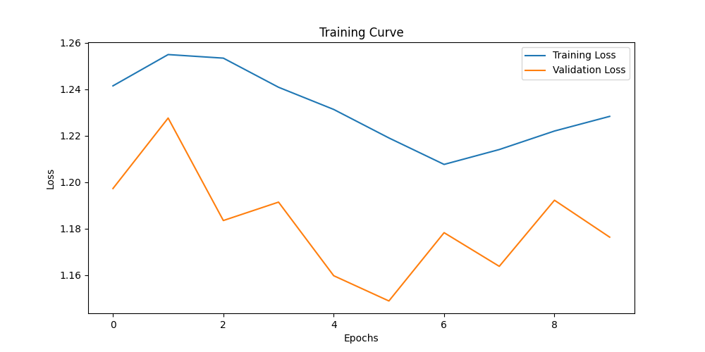

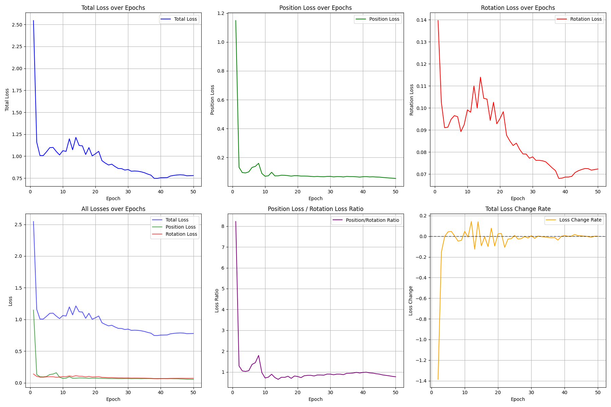

### Network Architectures

The architecture diagrams are available as PDFs and PNGs:

* [VisionNet architecture](assets/images/model_architectures/VisionNet.pdf)
* [IMUNet architecture](assets/images/model_architectures/IMUNet.pdf)

For the complete deep-learning pipeline, dataset generation, training, evaluation, and implementation details, see:

➡️ **[Deep VIO README](Deep_VIO/README.md)**

---

# 3. Visual Results

Ground-truth and model trajectories are included in `assets/images`.

### Ground-Truth Test Trajectories

| Infinity                                                     | Random                                                   | Spiral                                                   |
| ------------------------------------------------------------ | -------------------------------------------------------- | -------------------------------------------------------- |
| 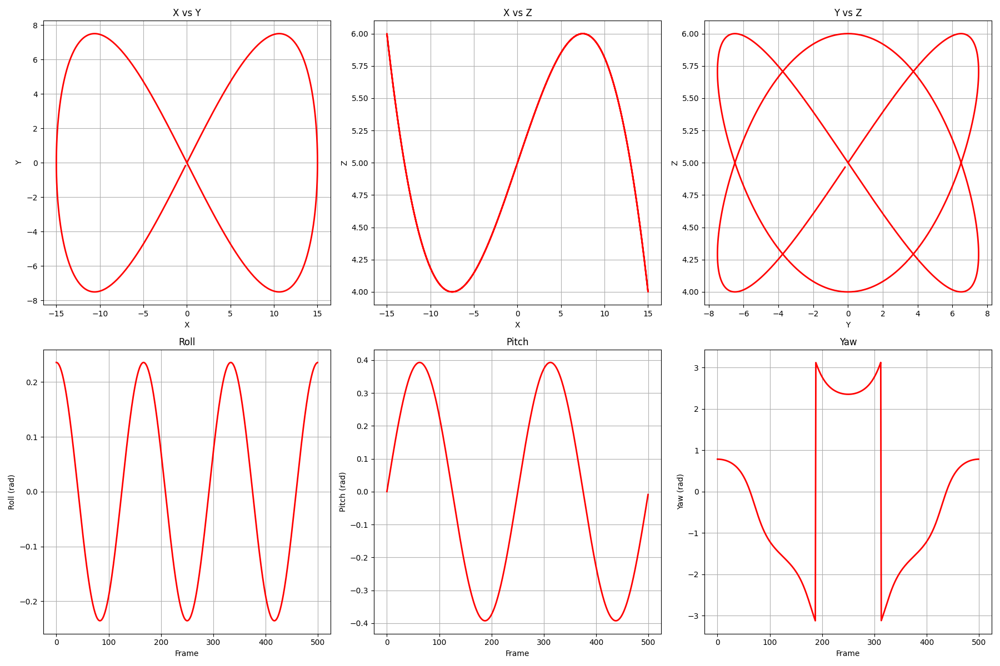 | 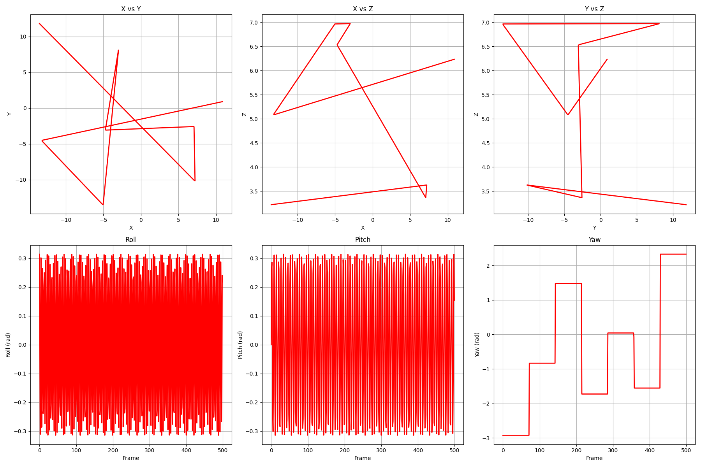 | 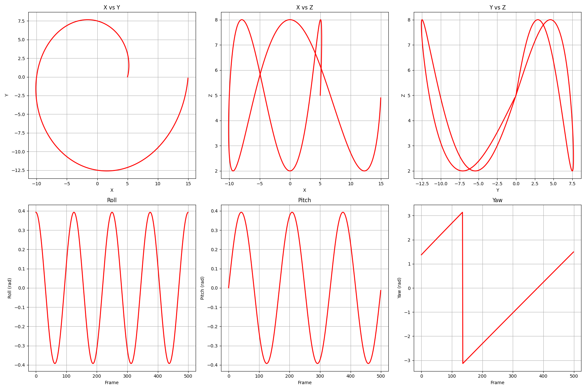 |

3D versions are also provided:

* `infinity_3d.png`
* `random_3d.png`
* `spiral_3d.png`

### Model Outputs

The repository includes trajectory visualizations for both vision-only and IMU-only models:

| Modality    | Infinity                                                                | Random                                                              | Spiral                                                              |
| ----------- | ----------------------------------------------------------------------- | ------------------------------------------------------------------- | ------------------------------------------------------------------- |
| Vision-Only | 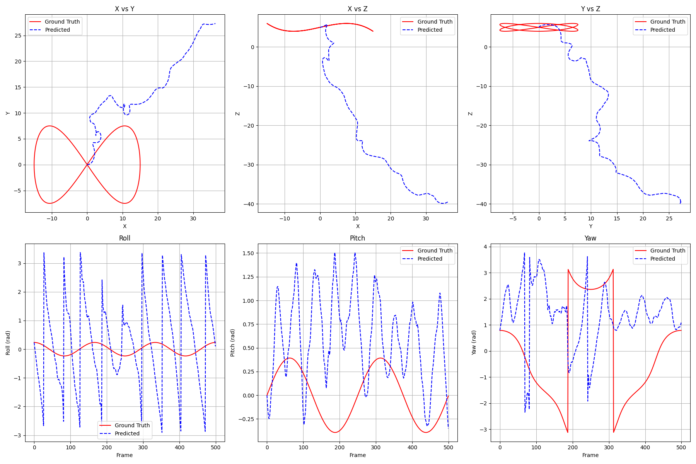 | 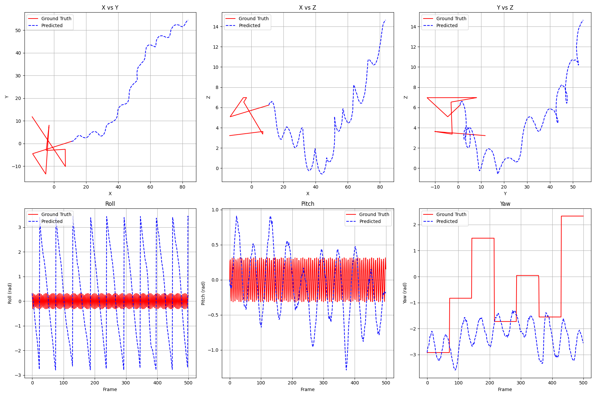 | 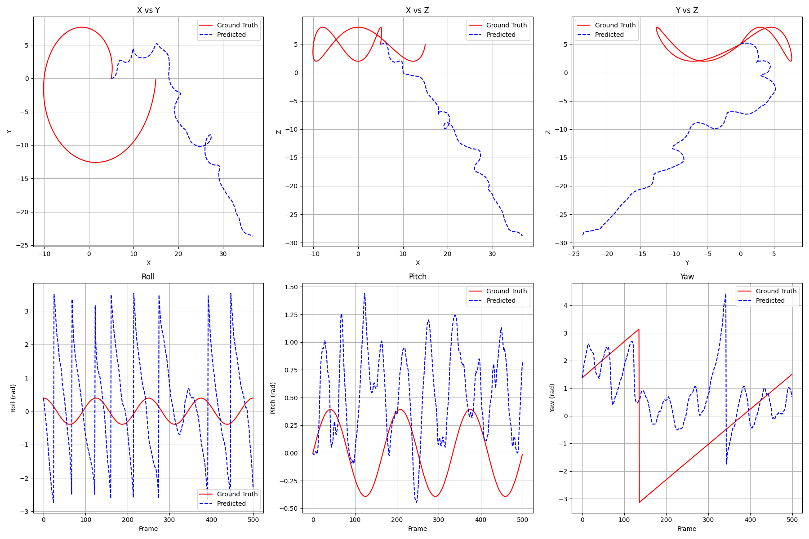 |
| IMU-Only    | 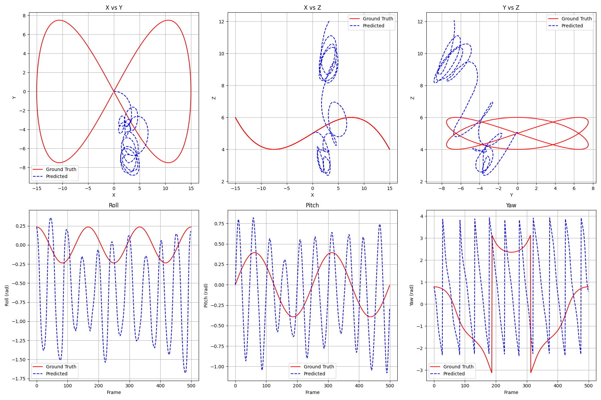       | 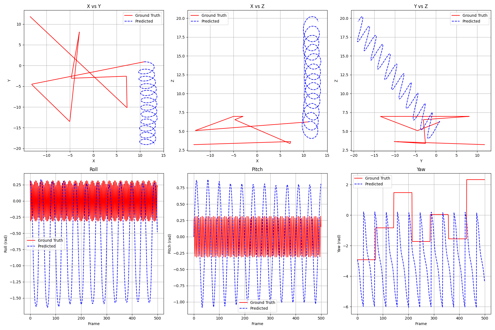       | 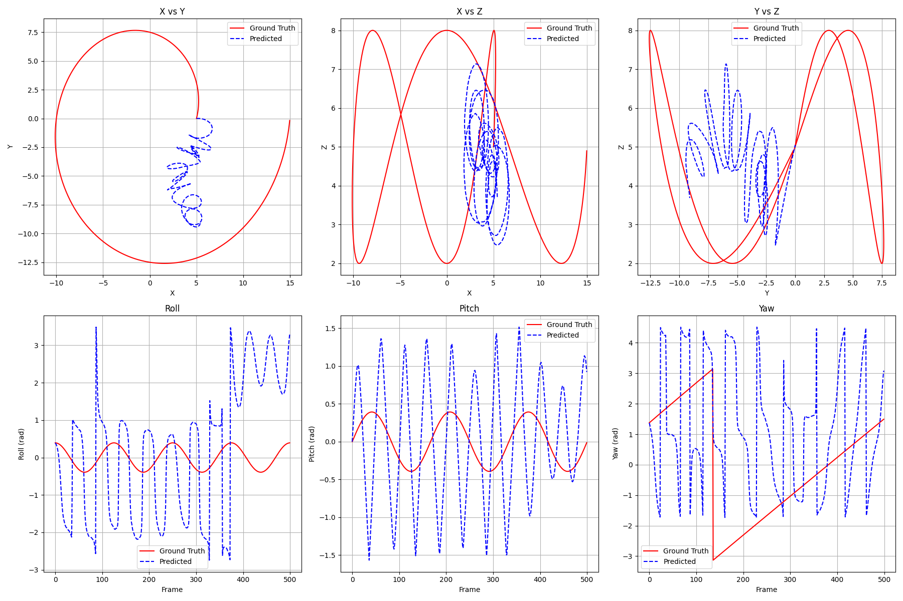       |

---

# 4. Repository Structure

```text
Deep_Undeep_VIO/
│
├── Classical_VIO/
│   ├── config.py
│   ├── dataset.py
│   ├── feature.py
│   ├── image.py
│   ├── msckf.py
│   ├── msckf_works.py
│   ├── plot.py
│   ├── utils.py
│   ├── viewer.py
│   ├── vio.py
│   └── imgs/
│
├── Deep_VIO/
│   ├── data_gen.blend
│   ├── data_gen.py
│   ├── evaluation_results.csv
│   ├── README.md
│   └── vio.py
│
├── assets/
│   ├── images/
│   │   ├── model_architectures/
│   │   ├── test_outputs/
│   │   ├── testing_ground_truth/
│   │   ├── training_curves/
│   │   └── training_ground_truth/
│   │
│   └── videos/
│       ├── Output_Classical_VIO.gif
│       ├── Output_Classical_VIO.mp4
│       └── VideoPresentationDeepVIO_compressed.mp4
│
├── reports/
│   ├── Classical_VIO.pdf
│   └── Deep_VIO.pdf
│
├── LICENSE
└── README.md
```

---

# 5. Getting Started

## Prerequisites

The project is primarily implemented in **Python 3.8+**.

The deep-learning component uses **PyTorch**, while the classical pipeline relies on standard numerical, computer-vision, and scientific Python libraries.

Clone the repository:

```bash
git clone https://github.com/Divam-Trivedi/Deep_Undeep_VIO.git
cd Deep_Undeep_VIO
```

### Classical VIO

Navigate to the classical implementation:

```bash
cd Classical_VIO
```

See the dedicated README for dependency installation, configuration, dataset setup, and execution instructions.

➡️ **[Classical VIO Documentation](Classical_VIO/README.md)**

### Deep VIO

Navigate to the deep-learning implementation:

```bash
cd Deep_VIO
```

The Deep VIO README contains instructions for synthetic data generation, training, evaluation, and visualization.

➡️ **[Deep VIO Documentation](Deep_VIO/README.md)**

---

# 6. Documentation

More detailed technical information is available in the project reports.

### Technical Reports

* 📄 **[Classical VIO Report](reports/Classical_VIO.pdf)**
* 📄 **[Deep VIO Report](reports/Deep_VIO.pdf)**

The reports provide additional details on the theory, implementation, experiments, and results.

---

# 7. Presentation

A presentation video demonstrating the project is included in the repository:

🎥 **[Deep VIO Presentation](assets/videos/VideoPresentationDeepVIO_compressed.mp4)**

A visualization of the classical VIO output is also available:

🎥 **[Classical VIO Output](assets/videos/Output_Classical_VIO.mp4)**

---

# 8. Key Takeaways

This project highlights several important observations about visual-inertial odometry:

1. **Classical VIO remains highly effective** when accurate geometric models, feature tracking, and carefully designed filtering are available.
2. **Deep VIO provides an alternative formulation** in which motion estimation and sensor fusion can be learned directly from data.
3. **Sensor fusion is not guaranteed to improve performance** over individual modalities, particularly when the training distribution or synthetic sensor characteristics favor one modality.
4. **Synthetic data provides a controlled environment** for studying learned VIO and isolating the effects of different motion patterns and sensor modalities.
5. Comparing classical and learned approaches provides insight into the trade-offs between **model-based estimation and data-driven estimation**.

---

# 9. License

This project is distributed under the **MIT License**.

See [`LICENSE`](LICENSE) for the full license text.

---

## Author

**Divam Trivedi**, 
_MS Robotics, WPI 2026_

<p align="center">
  <a href="https://github.com/Divam-Trivedi">GitHub</a>
  &nbsp;•&nbsp;
  <a href="mailto:divam.trivedi@gmail.com">Email</a>
  &nbsp;•&nbsp;
  <a href="https://divamtrivedi.com">Website</a>
</p>
